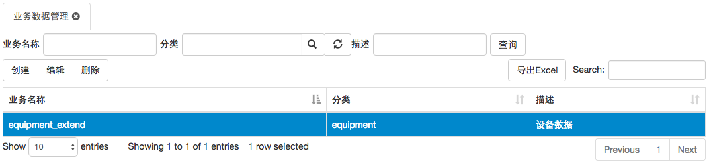
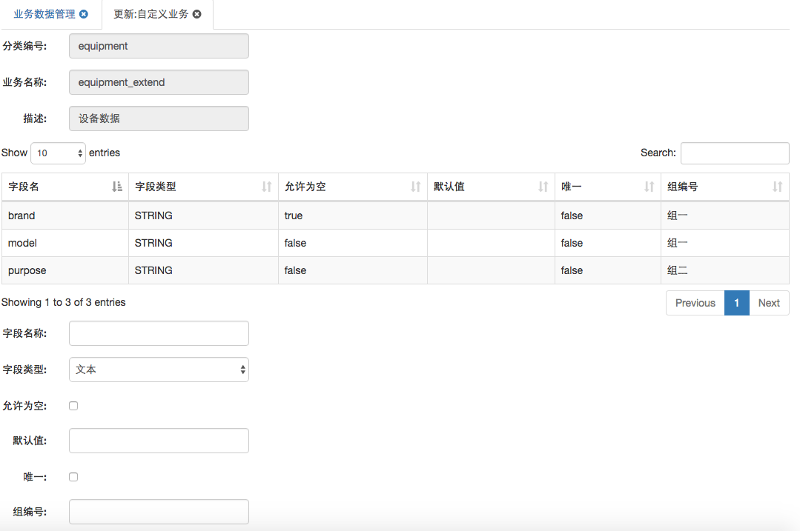
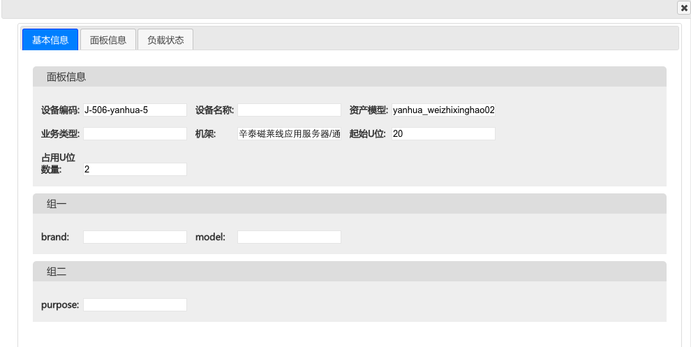

# 业务数据管理

业务数据管理是管理资产分类对应的业务数据表以及字段的入口。

包含属性：

1. 业务名称，此名称将作为表名，创建业务数据表
2. 分类，指与业务数据表管理的资产分类
3. 描述，对此表的简单描述，将显示在后端列表中，作为数据操作入口

### 创建业务数据表

扩展字段 >> 业务数据管理 >> 创建 >> 输入属性值 确认后，表将被创建

选中生成的记录，点击“编辑”按钮，进入编辑页面，给表添加字段，

描述字段的属性有：

1. 字段名称
2. 字段类型
3. 允许为空，Boolean
4. 默认值
5. 唯一，Boolean
6. 组编号，用于在界面上的分组显示

前5个属性都是服务于数据库的，没什么特殊的。这里需要特别介绍的是“组编号”，“组编号”主要用于资产分类为“设备”的资产，资产的扩展属性在界面上已“组编号”为依据分组显示

备注：

* 新创建的业务数据表，不会立即同步到界面上，目前需要重启后端服务，刷新界面
* 创建的业务数据表中，除了自定义的字段外，还包含一个Id字段，此字段用于存储资产编号

### 添加资产扩展属性值

具体资产扩展属性值的方式有多种

1. 在后端管理页面直接添加
2. 通过excel导入
3. 通过添加资产接口添加
4. 通过资产同步方案接口添加
5. 通过3D界面资产上架添加